 ---
layout: default
title:  Molding and Casting
---

##03_25 Molding and Casting  

On wednesday 03.25.2015 we've got the [eight online lesson](https://vimeo.com/123215414) with Neil Gershenfeld.  
The next lessons can be found on the [Fab Academy account on Vimeo](http://vimeo.com/fabacademy).

For this week the assignment was  

>
>   design a 3D mold, machine it, and cast parts from it  

The mind setting is:  

1. first  thin make the master, a positive to start from; it will be the shape you want to cast + material duct + vent + guides to align the two parts of the mold.  

1. than make the mold using this master; put it in a container and pour the material to make the mold.  

1. cast as many time as you want with the material you prefer.

This is in theory.  

I decided to make the moon surface; [Sara Jessop](http://fab.cba.mit.edu/classes/863.14/people/sarah_jessop/week-06.html) has made something similar in 2014.  

Another interesting attempt is the [Craig Kaplan](http://isohedral.ca/moon-shot-espresso-cup/) one.  

  

I started searching for some hi-res height map of the lunar soil  

    
  
Here some interesting link to visit about moon take-over
[Wikispaces](http://ltvt.wikispaces.com/Additional+Textures)  
[Unnamed Spaceflight](http://www.unmannedspaceflight.com/index.php?showtopic=6646&pid=169851&st=60&#entry169851)  
[LOLA - Lunar Orbiter Laser Altimeter](http://imbrium.mit.edu/EXTRAS/CELESTIA/)

##Design  
With Rhino I generated a height-map that fit in the wax stock with 2mm of difference between highest and lower point.  

  

As engrave it may works well, but for a molding I'd like to make something that involves a 3 dimensional shape, so I draw a mood starting from a sphere and using an height map as a displacement map and...the file was 450mb! First of all I reduced it to 50mb with MeshLab, following [these steps](https://www.youtube.com/watch?v=w_r-cT2jngk) and I made a mold like this.  

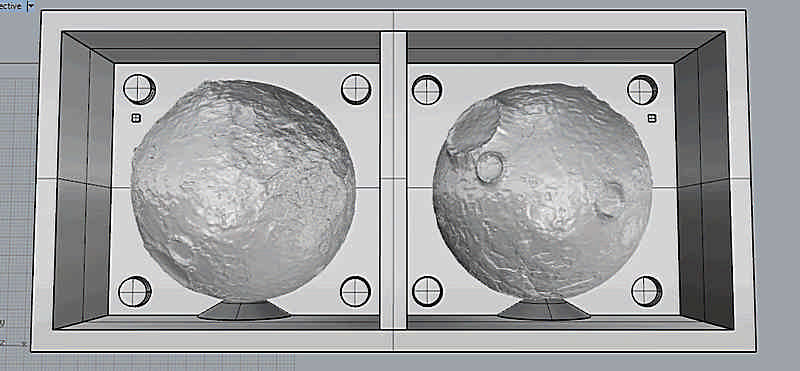 

50mb was still too much to make the path to mill (the computer has ran out of memory) and so I reduced to 13mb/132kpolygons; in this size it took about 3hrs just to calculate the rough path with Modela Player 4.    

While waiting for the path I wonder about the texture of the moon in the almost vertical zone; I think here it will lost a lot of detail because of the orientation of the surface. Than I ran a second process to make a more complex mold made of 6 piece to better print over all the spheric surface. Here some sketch.  

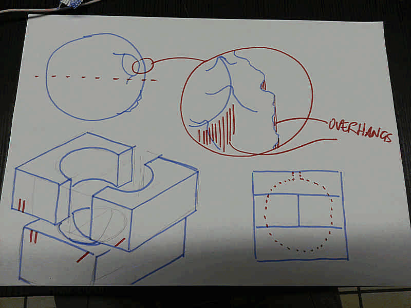 

 

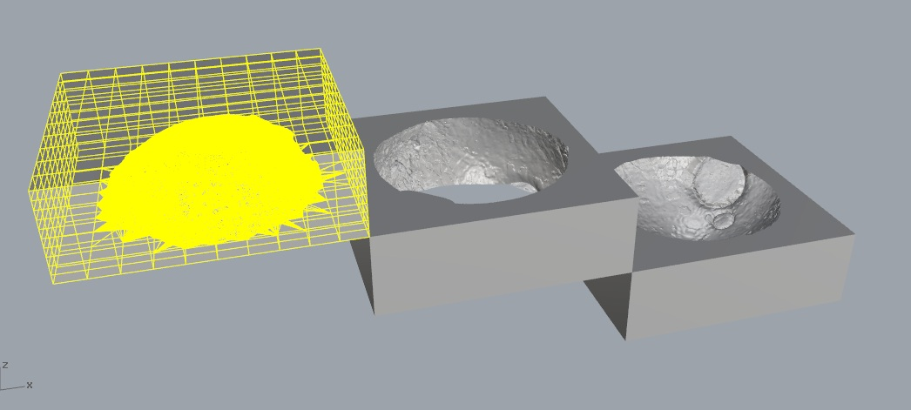 

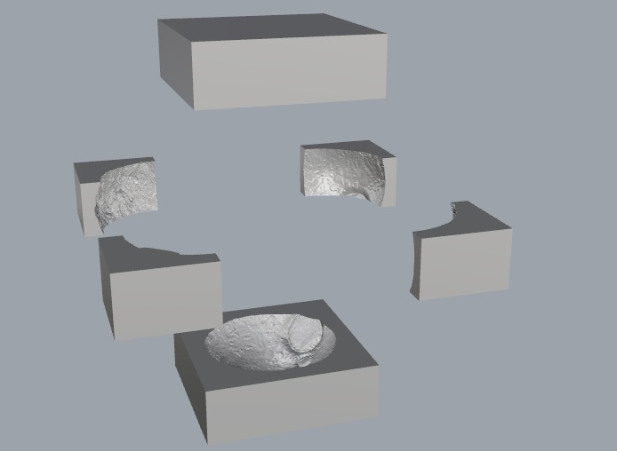 

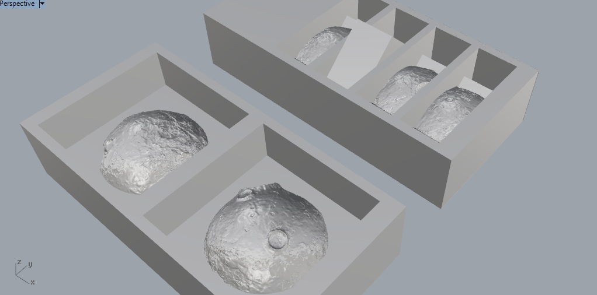 

I hope I'll have the material and the time to make also this test.  
Step ahead.

**Download**  
[Master milled in wax](./files/03_25_mold_cast/moon_mold_132k_v1.7z)
  
##Making the master  

Mill the master from the wax has taken several hours because of the large volume to mill off (about 5hrs for the rough finish with a 5mm flat mill and some more for the finish with the 1mm flat mill).

To generate the path I used Vectric Cut3D, program with a user friendly GUI that guides you through 7 steps: orientation, material size and margins, roughing toolpath, finish toolpath, cut out, preview, export.  

For the rough toolpath I used:  
	mill: 3mm endmill  
	passdepth: 1mm  
	stepover: 1.5mm  
	feedrate: 40mm/s  
	plungerate: 20mm/sacrificial

and it has taken about 4hrs 16min to finish the job.

For the finish toolpath I used:  
	mill: 1mm endmill  
	passdepth: (auto)  
	stepover: 0.5mm  
	feedrate: 20mm/s  
	plungerate: 10mm/sacrificial  
	
and it has taken about 2hrs 25min to finish the job.

NOTE: cut3D has a lot of export format but it hasn't the .rml (the Roland format), but nevermind: if you save in .rol and than rename it in name_of_the_file.rml it will work fine.

 

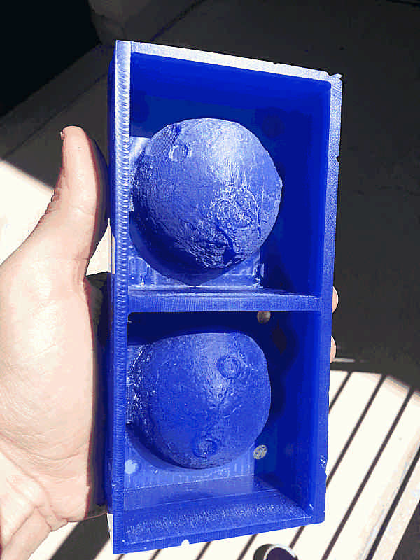 

 

 

I made one little mistake, but I can't do differently: I used a too short mill so the shaft touched the vertical walls of the model. It has not produced critical flaws, but the finish was not completed, so the lower part of the wax master was not finished, neither the closure interface. We'll see later how the model came out and how the mold fits.  
  
  
##Making the mold  

For the mold I used MoldMax60, a 60A shore silicon with a 3% in weight catalyst.  
For this work you may need:  
- a sacrificial surface (cardboard in this case)  
- a gram scale  
- 3 containers of about 200ml(plastic cup in this case)  
- a non-plastic stick to mix (the best is glass but I used plywood; don't look at me as an example, prefer to use straight profile).  
- a release agent with a little brush  
- gloves and mask  
  
 

This silicon has a pot life of about 10mins at 23°C so it was fairy comfortable to mix it. When mixing pay attention to do it slowly to produce less bubbles. This silicon is quite fluid so bubbles can easily emerge; you can speed up this process by vacuum, or vibrating the container, but the best result with this material was to sting the mass on one side: you can see at naked eye bubbles rise and pop.  
In the meantime is highly recommended to coat the master with some releasing agent using a brush; the releasing agent is your friend, use it, don't be 
thrifty.
After 5-6mins mixing you have an homogeneous highly viscous liquid; you have to pour it into the master-mold very slowly to avoid to include bubbles, expecially between wax and silicon. Pour it starting from the lower point, rising the container at about 30cm to reduce the size of the flow.  

Now you have to wait 24hrs.  
  
    
##Demolding  

Using a cutter I demolded easily the silicon from the wax.
As you can see the last part has remained with a rough finish, but it will work well anyway.  

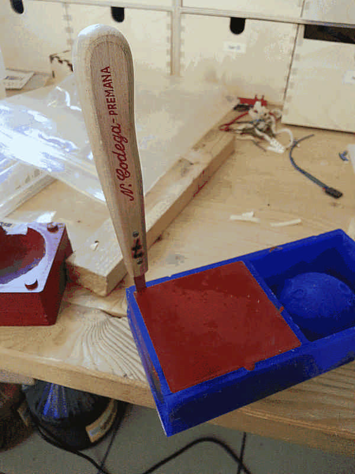 

 

 

As you can see the last part has remained with a rough finish, but it will work well anyway.  

 
  
  
##Casting  

You may need:
- three containers (plastic cups)  
- a gram scale  
- a non-plastic stick  
- a cardboard box
- a chronometer
- the resin you choose (in this case Smooth on 325)  
- [Tico Tico](https://www.youtube.com/watch?v=To09Km0y8ic) by Paco De Lucia
- gloves and mask  

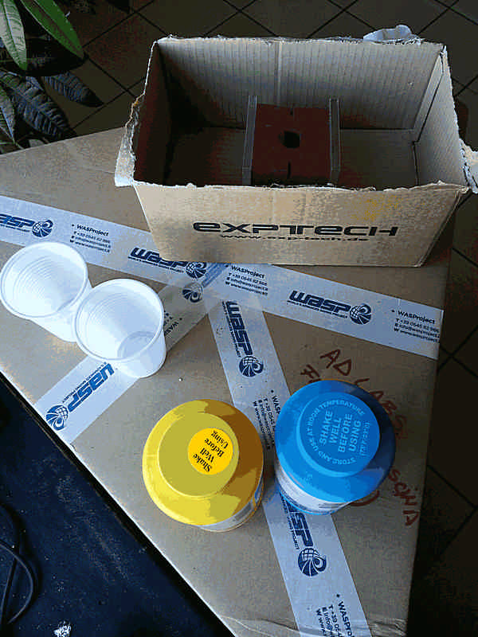 

First I closed well the mold, using two pieces of PMMA to evenly distribute the pressure. Than I measured the volume empirically filling it with some water and pouring it inside a plastic cup, that way I know how much material I've to mix and moreover I test the watertight sealing.  

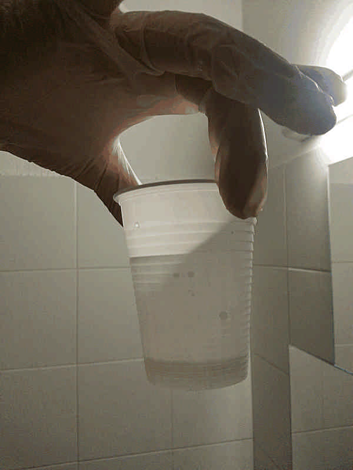 

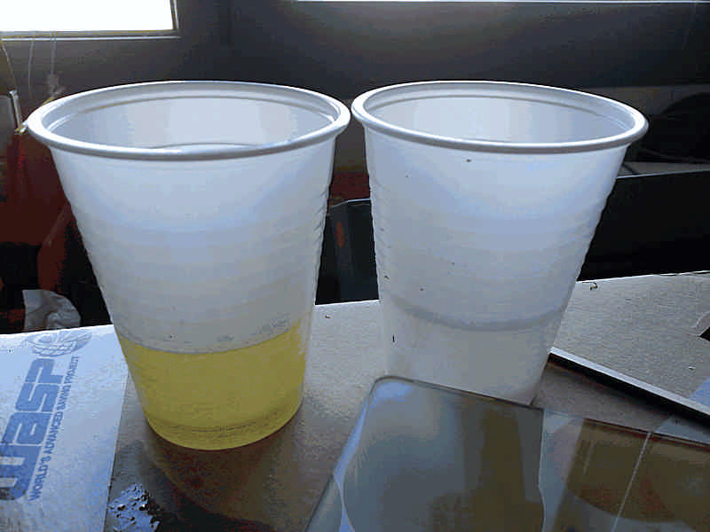 

After dry up the mold and coated with releasing agent I [shaked](http://www.dailymotion.com/video/x27wqc_cocktail-di-celentano_music) well and vigorously the jars of the components using Tico Tico as base, than I mixed 1 to 1 in volume of Smooth on 325 resin.  

 

This material has a pot life of 2.5 mins so you have to set all quite well to pour in 2 mins.  Ask to a friend to help you, it may be crucial; in my case Carlo Liuzza helped me doing everything well.  

 

It should cure in 10mins, but I waited more.  
Opening the mold the "moon" was stiff and solid, quite heavy.

 

 

 

On the surface it's not perfectly cured and in some point is still sticky, while in some others is perfectly dry. I think it depends on the mixing, in such a short time I mixed slowly to avoid bubbles; probably it has to be mixed more before curing.  
On the surface appeared white streaks that remembers cloudy masses; it fits well on this model, but I wonder about what it can depend on.  

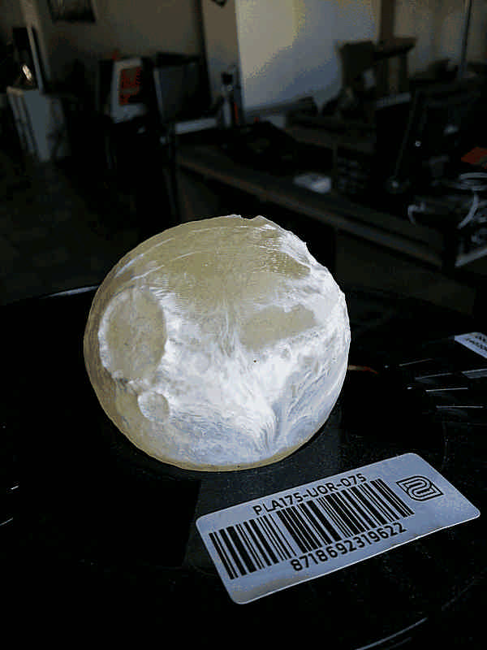 

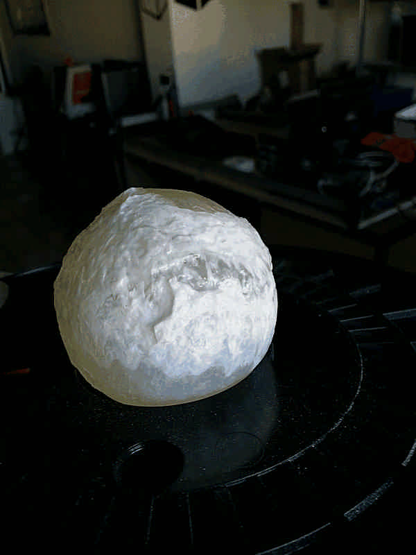 

<!---

AGGIUNGERE QUI ULTERIORI AVANZAMENTI

-->

